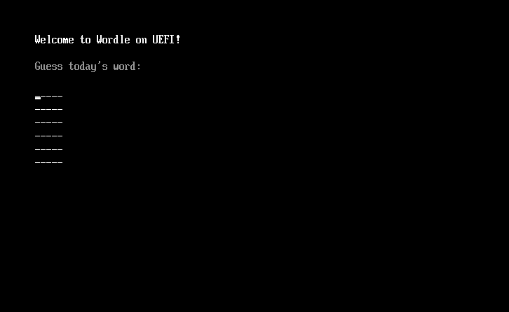

# Wordle for UEFI

> Who says you need an operating system to play Wordle?

A clone of the popular word game, Wordle, for UEFI.

<details>
<summary>What's UEFI?</summary>

Let's start with the BIOS - which you might have heard of before. BIOS stands for Basic Input Output System and is a program that runs when you start your computer. It's in charge of reading and executing the bootloader from a drive, which then loads your operating system.

UEFI is a modern replacement for BIOS that most computers today run. It has more features and is way easier to program with! When your computer boots up, the UEFI firmware looks for a special EFI file to run (which might eventually load a full-fledged os). This project compiles to a `.efi` file that the UEFI firmware of your computer can run.

</details>



## How do I run this?

### On your computer

The UEFI image is built for x86_64 systems running UEFI class 2 or above. Basically any modern computer in use today should support this without problems. Also: Secure Boot will need to be disabled in the settings.

1. Download the zipped disk image file from [here](https://github.com/radiantly/Wordle-UEFI/releases/download/latest/wordle-uefi.img.zip).
2. Flash the file to a disk

   - **On Windows**, you can use the [rufus utility](https://github.com/pbatard/rufus) to save the disk image to a pen drive.
   - **On Linux**, you can use `unzip` and `dd` as shown below. Replace `/dev/sdX` with the path of the drive you would like to write to.

     ```sh
     unzip -p wordle-uefi.img.zip | sudo dd bs=512 of=/dev/sdX conv=fdatasync status=progress
     ```

3. You can now boot from the device you created!

### On QEMU

[Download](https://github.com/radiantly/Wordle-UEFI/releases/download/latest/wordle-uefi.img.zip), extract, and run using the following command:

```sh
qemu-system-x86_64 -cpu qemu64 -bios /usr/share/edk2-ovmf/x64/OVMF.fd -drive file=wordle-uefi.img,if=ide,format=raw
```

To boot with UEFI on QEMU, you will need to install the edk2-ovmf package. Replace `/usr/share/edk2-ovmf/x64/OVMF.fd` in the above command with the path where it is saved.

## License

MIT

## Contributing

Found a mistake or want to add a feature? Open an issue/PR!
